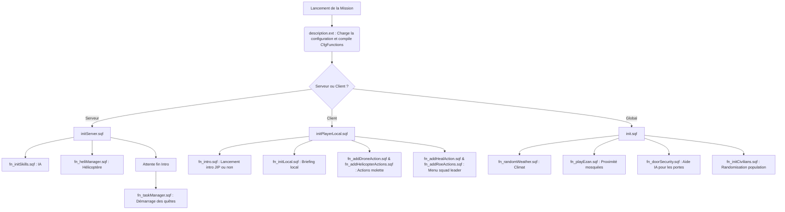

# Operation Royal Alliance (ORA) - Zargabad [SP/COOP]

Ce fichier présente l'architecture technique de la mission **Operation Royal Alliance (ORA)** sur la carte Zargabad, jouable en Solo ou Coopératif.

---

## 📂 Structure Générale

La mission est structurée autour d'un ensemble de scripts configurés de manière modulaire à l'aide de la bibliothèque de fonctions d'Arma 3 (`CfgFunctions`).

```
RACS.cup_Zargabad_a3/
│
├── description.ext               # Configuration principale d'Arma 3 & CfgFunctions
├── init.sqf                      # Cycle d'initialisation global (Serveur)
├── initServer.sqf                # Initialisations spécifiques au Serveur
├── initPlayerLocal.sqf           # Initialisations spécifiques aux Joueurs (Clients)
├── CfgSounds.hpp                 # Déclaration des effets sonores (généré)
├── stringtable.xml               # Clés de traduction compilées (généré)
│
├── Functions/                    # Scripts fonctionnels par thématique
│   ├── Briefing/                 # Textes de briefing et OPORD
│   ├── Civilian/                 # Apparences et noms des civils de Zargabad
│   ├── Drone/                    # Système de support drone
│   ├── Environment/              # Gestion météo, portes de bâtiments et Ezan
│   ├── Helicopter/               # Logique avancée de transport et soutien aérien
│   ├── Player/                   # Identités des joueurs, équipements et soins
│   ├── UI/                       # Fonctions de communication et radio
│   └── Task/                     # Tasks manager et logique des tâches (00 à 06)
│
├── TTS/                          # Pipeline de voix synthétisées
│   ├── generate_radio.py         # Script Python de génération audio (Azure + pydub)
│   └── output/                   # Dossier contenant les fichiers audio .ogg générés
│
├── compile_stringtable.py        # Compilateur Python de stringtable XML modularisés
├── update_sounds.py              # Synchroniseur Python automatique pour CfgSounds
└── strip_comments.py             # Script de nettoyage facultatif des commentaires SQF
```

---

## 🔄 Flux d'Initialisation (Cycle de vie)

Lors du chargement de la mission, le moteur d'Arma 3 exécute les scripts d'initialisation dans l'ordre suivant :



---

## 🛠️ Description des Composants Majeurs

### 1. Gestion des Joueurs & IA (`Functions/Player/`)
*   **Identité dynamique ([fn_initIdentity.sqf](Functions/Player/fn_initIdentity.sqf)) :** Assigne des prénoms locaux réalistes, des visages adaptés, des voix et des hauteurs vocales aléatoires à l'ensemble des joueurs, synchronisés en multijoueur (JIP inclus).
*   **Uniforme dynamique ([fn_initLoadout.sqf](Functions/Player/fn_initLoadout.sqf)) :** Équipe les joueurs de tenues RACS aléatoires (casques, gilets tactiques, cagoules) tout en préservant leurs armes configurées dans l'éditeur.
*   **Soin intelligent ([fn_addHealAction.sqf](Functions/Player/fn_addHealAction.sqf)) :** Permet d'ordonner aux IA blessées de l'escouade d'utiliser leurs trousses de secours en se mettant à l'abri temporairement.
*   **Règles d'Engagement ([fn_addRoeActions.sqf](Functions/Player/fn_addRoeActions.sqf)) :** Menu d'escouade pour basculer les IA en mode *Infiltration* (BLUE, discret, vitesse limitée, autocombat désactivé), *Normal* (YELLOW, aware) ou *Assaut* (RED, agressif, rapide, couverture intelligente).

### 2. Population & Climat Local (`Functions/Civilian/` & `Environment/`)
*   **Système de Templates ([fn_initCivilians.sqf](Functions/Civilian/fn_initCivilians.sqf)) :** Remplace les unités civiles par des modèles incluant des barbes et lungees locaux pour les hommes, et des modèles féminins (mod MAX Woman).
*   **Portes Securisées ([fn_doorSecurity.sqf](Functions/Environment/fn_doorSecurity.sqf)) :** Ouvre et ferme dynamiquement les portes métalliques des bâtiments de Zargabad devant les IA pour éviter qu'elles ne s'y bloquent.
*   **Appel à la prière ([fn_playEzan.sqf](Functions/Environment/fn_playEzan.sqf)) :** Diffuse l'Ezan en 3D depuis les minarets uniquement lorsque les joueurs se situent à proximité pour économiser la bande passante réseau.

### 3. Tâches Procédurales (`Functions/Task/`)
*   Le script [fn_taskManager.sqf](Functions/Task/fn_taskManager.sqf) tire au sort une mission parmi 7 scénarios aléatoires ([fn_task00.sqf](Functions/Task/fn_task00.sqf) à [fn_task06.sqf](Functions/Task/fn_task06.sqf)).
*   Chaque tâche gère son propre spawn sécurisé (minimum 250m des joueurs), ses objectifs (otage, sabotage, assassinat, etc.) et son propre nettoyage d'entités après accomplissement.

### 4. Support Hélicoptère avancé (`Functions/Helicopter/`)
*   Le [fn_heliManager.sqf](Functions/Helicopter/fn_heliManager.sqf) est une machine d'état complète gérant un hélicoptère UH-60L allié.
*   Types de supports disponibles :
    *   **CAS :** Appui feu aérien avec détection dynamique des cibles Opfor.
    *   **Ravitaillement (LIVRAISON) :** Largage d'une caisse dont le contenu (munitions, chargeurs) s'adapte automatiquement et dynamiquement aux armes portées par les joueurs.
    *   **Véhicule :** Largage d'un véhicule de reconnaissance (Land Rover MG RACS).
    *   **Extraction/Débarquement :** Déploiement et récupération tactiques de l'escouade.

---

## 🌍 Pipeline de Localisation

Les textes de la mission sont modularisés. Chaque action possède son propre fichier de traduction `.xml` (ex: `fn_addRoeActions.xml`).
*   **Ne modifiez jamais** directement `stringtable.xml`.
*   Ajoutez ou éditez vos clés XML dans les dossiers correspondants de `Functions/`.
*   Exécutez `python compile_stringtable.py` pour compiler les modifications dans le fichier global final.

---

## 🎙️ Pipeline Audio (Dialogue Radio)

Le système de dialogues radio utilise des voix de synthèse Microsoft Neural améliorées par des effets DSP.
*   Pour générer de nouveaux audios, modifiez les clés anglaises du XML.
*   Exécutez `python TTS/generate_radio.py` (nécessite `edge-tts` et `pydub` installés sur Python).
*   Exécutez `python update_sounds.py` pour enregistrer automatiquement les sons nouvellement créés dans `CfgSounds.hpp`.
